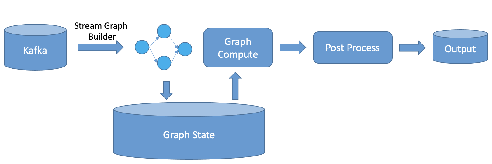
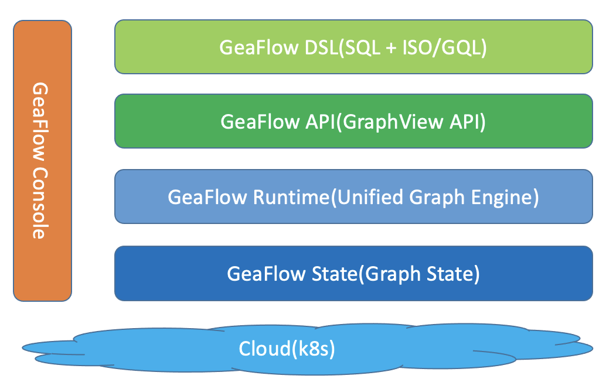

# GeaFlow简介
GeaFlow是蚂蚁集团开源的分布式实时图计算引擎，目前广泛应用于金融风控、社交网络、知识图谱以及数据应用等场景。GeaFlow的核心能力是流式图计算,流式图计算相比离线图计算提供了一种高时效性低延迟的图计算模式，它主要包含流式构图、流式图计算以及图计算结果后置处理等过程。流式构图将外部数据源的数据比如Kafka通过一些ETL处理转换成图的点边结构实时写入图存储中。流式图计算则是对图数据进行实时分析处理，包括图遍历计算和图算法计算。后置处理则是对图计算的结果做进一步的ETL等加工处理然后写入结果表。GeaFlow实现了一体化的Pipline运行方式实现整个处理过程。

相比传统的流式计算引擎比如Flink、Storm这些面向表数据的实时处理系统而言，GeaFlow主要面向图数据的实时处理，支持更加复杂的关系分析计算，比如多度关系实时查找、环路检查等；同时也支持图表一体的实时分析处理，能同时处理表数据和图数据。和离线图计算引擎比如Spark GraphX等系统相比，GeaFlow流图计算能力能提供更好的时效性保证。

# 技术概览
GeaFlow整体架构如下所示：

GeaFlow整体架构从上往下包含以下几层：
* **GeaFlow DSL**
  GeaFlow对用户提供图表融合分析语言，采用SQL + ISO/GQL方式.用户可以通过类似SQL编程的方式编写实时图计算任务.
* **GraphView API**
  GeaFlow以GraphView为核心定义的一套图计算的编程接口,包含图构建、图计算以及Stream API接口.
* **GeaFlow Runtime**
  GeaFlow运行时，包含GeaFlow图表算子、task调度、failover以及shuffle等核心功能.
* **GeaFlow State**
  GeaFlow的图状态存储，用于存储图的点边数据.同时流式计算的状态如聚合状态也存放在State中.
* **K8S Deployment**
  GeaFlow支持K8S的方式进行部署运行.
* **GeaFlow Console**
  GeaFlow的管控平台，包含作业管理、元数据管理等功能.

# 应用场景
## 实时反套现
在信贷风控的场景下，如何进行信用卡反套现是一个典型的风控诉求。基于现有的套现模式分析，可以看到套现是一个环路子图，如何快速，高效在大图中快速判定套现，将极大的增加风险的识别效率。以下图为例，通过将实时交易流、转账流等输入数据源转换成实时交易图，然后根据风控策略对用户交易行为做图特征分析，比如环路检查等特征计算，实时提供给决策和监控平台进行反套现行为判定。通过GeaFlow实时构图和实时图计算能力，可以快速发现套现等异常交易行为，极大降低平台风险。

## 实时归因分析
在信息化的大背景下，对用户行为进行渠道归因和路径分析是流量分析领域中的核心所在。通过实时计算用户的有效行为路径，构建出完整的转化路径，能够快速帮助业务看清楚产品的价值，帮助运营及时调整运营思路。实时归因分析的核心要点是准确性和实效性。准确性要求在成本可控下保证用户行为路径分析的准确性;实效性则要求计算的实时性足够高，才能快速帮助业务决策。
基于GeaFlow流图计算引擎的能力可以很好的满足归因分析的准确性和时效性要求。如下图所示：

GeaFlow首先通过实时构图将用户行为日志转换成用户行为拓扑图，以用户作为图中的点，与其相关的每个行为构建成从该用户指向埋点页面的一条边.然后利用流图计算能力分析提前用户行为子图，在子图上基于归因路径匹配的规则进行匹配计算得出该成交行为相应用户的归因路径，并输出到下游系统。