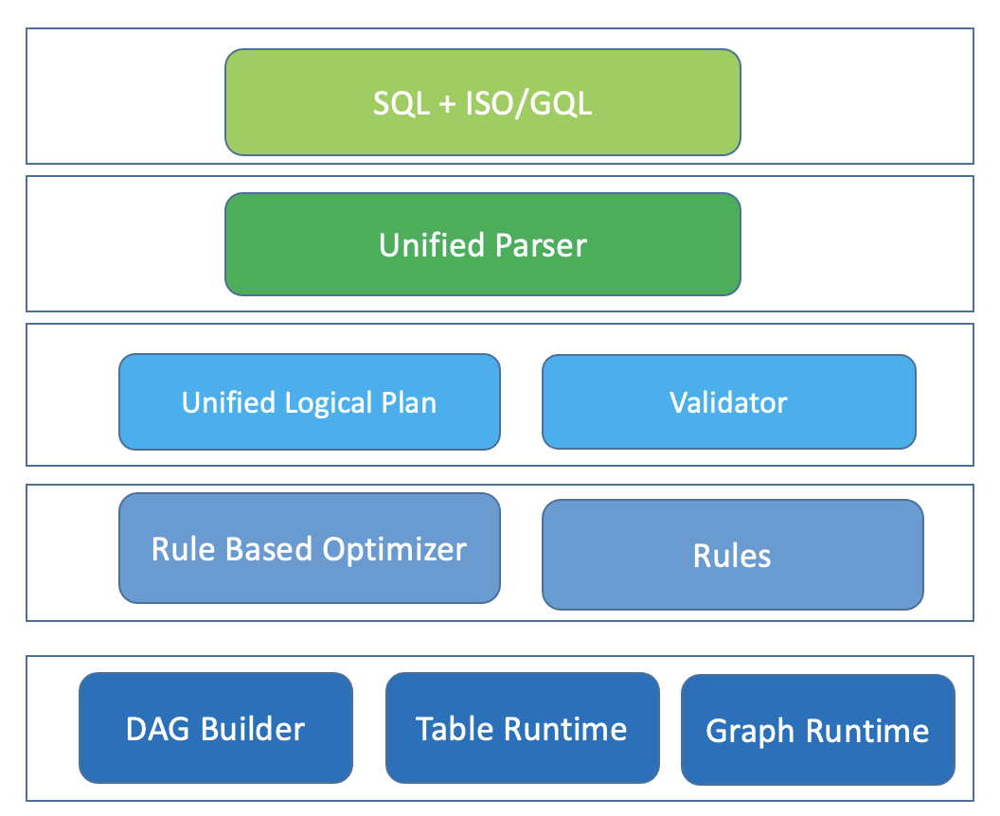
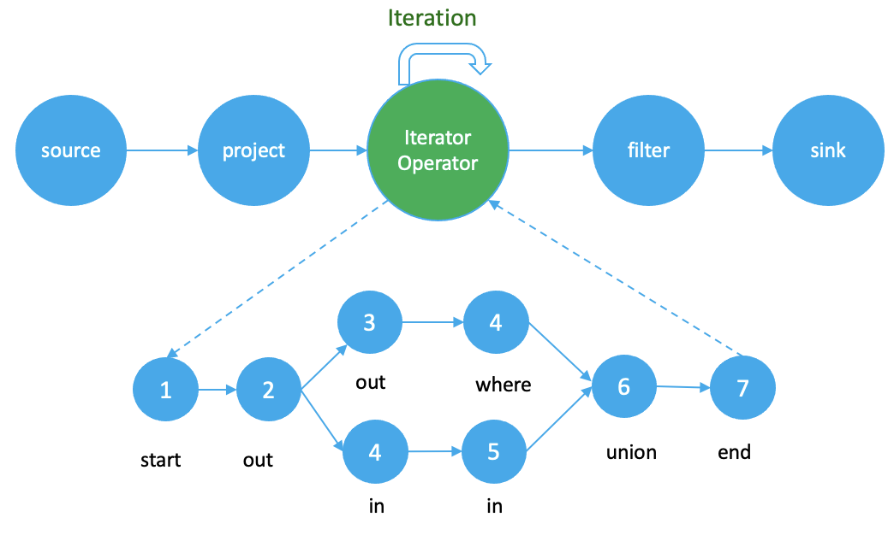

# GeaFlow DSL Architecture
The overall architecture of GeaFlow DSL is shown in the following figure:

* DSL Language Layer
  Defines the language of GeaFlow DSL, which currently uses SQL + ISO/GQL Hybrid analysis language.
* Unified Parser Layer
  The unified syntax parsing layer of DSL, which mainly converts DSL text into a unified AST syntax tree. GeaFlow extends the GQL syntax based on [Apache Calcite](https://calcite.apache.org/), and parses the SQL syntax and GQL into a unified syntax tree.
* Unified Logical Execution Plan
  GeaFlow extends a logical execution plan of the graph on the basis of relational algebra, achieving a unified logical execution plan for the graph and table.
* Optimizer
  Based on the existing SQL RBO optimizer, GeaFlow extends support for optimizing the graph execution plan, supporting optimization of the graph-logic execution plan.
* Physical Execution Plan Layer
  Contains the physical execution plan of the flowchart, responsible for converting the optimized flowchart logic execution plan into a runtime logic executable by the underlying framework through the DAG Builder.

# Main Execution Flow of DSL
The main execution flow of DSL is illustrated in the following figure:

The DSL text is first parsed by the Parser to generate the AST syntax tree, and then the Validator performs semantic checking and type inference to generate a validated AST syntax tree. The graph-logic execution plan is then generated by the Logical Plan transformer. The logical execution plan is optimized by the Optimizer to generate an optimized logical execution plan. The physical execution plan is then generated by the Physical Plan transformer, and the physical execution logic is generated by the DAG Builder. GeaFlow DSL uses a two-level DAG structure to describe the physical execution logic of the flowchart.

# Two-level DAG Physical Execution Plan
Unlike traditional distributed table data processing engines such as Storm, Flink, and Spark, GeaFlow is a flowchart-integrated distributed computing system. Its physical execution plan uses a two-level DAG structure for the flowchart, as shown in the following figure:

The outer layer DAG contains operator for table processing and iterative operator for graph processing, which is the main part of the physical execution logic and links the computing logic of the flowchart. The inner DAG expands the graph computation logic through the DAG, representing the specific execution of graph iterative computation.
